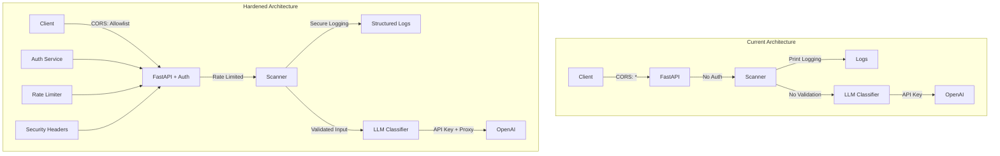

# OWASP Top 10 Security Hardening Plan for PISC

## Executive Summary

This document outlines a comprehensive security hardening plan for the PISC (Prompt Injection Scanner) application based on the OWASP Top 10 (2021) vulnerabilities identified during code review.

---

## Identified Vulnerabilities

### A01:2021 - Broken Access Control

| Issue | Location | Severity | Description |
|-------|----------|----------|-------------|
| CORS allows all origins | `api/main.py:101-107` | High | `allow_origins=["*"]` permits any domain |
| No rate limiting | `api/main.py` | High | No protection against DoS attacks |
| No authentication | `api/main.py` | Critical | Unrestricted API access |

### A02:2021 - Cryptographic Failures

| Issue | Location | Severity | Description |
|-------|----------|----------|-------------|
| API key exposure | `.env:2` | Critical | OpenAI API key visible in environment file |
| No secret rotation | `.env` | High | No mechanism for rotating secrets |
| Plaintext logging | `scanner.py:81-151` | Medium | Uses print() for sensitive data |

### A03:2021 - Injection

| Issue | Location | Severity | Description |
|-------|----------|----------|-------------|
| No input validation | `api/main.py:37-44` | Medium | ScanRequest has no max length validation |
| Unsafe JSON parsing | `api/main.py:159` | Medium | `json.loads()` without try/except |
| LLM prompt injection | `llm_classifier.py:64` | Medium | System prompt could be manipulated |

### A04:2021 - Insecure Design

| Issue | Location | Severity | Description |
|-------|----------|----------|-------------|
| No security headers | `api/main.py` | High | Missing HSTS, CSP, X-Frame-Options |
| Verbose error messages | `api/main.py:235` | Medium | Errors leak internal details |

### A05:2021 - Security Misconfiguration

| Issue | Location | Severity | Description |
|-------|----------|----------|-------------|
| Exposed to all interfaces | `api/main.py:285` | High | `host="0.0.0.0"` exposes to internet |
| No security middleware | `api/main.py` | High | Missing rate limiting, request size limits |
| Debug mode potential | Multiple files | Medium | Error handling may leak info |

### A06:2021 - Vulnerable and Outdated Components

| Issue | Location | Severity | Description |
|-------|----------|----------|-------------|
| Outdated dependencies | `web/package.json` | Medium | Many packages may have vulnerabilities |
| No dependency scanning | Project | High | No security audit workflow |

### A07:2021 - Identification and Authentication Failures

| Issue | Location | Severity | Description |
|-------|----------|----------|-------------|
| No API authentication | `api/main.py` | Critical | All endpoints unauthenticated |
| No API key management | Project | High | Users can't have individual keys |

### A08:2021 - Software and Data Integrity Failures

| Issue | Location | Severity | Description |
|-------|----------|----------|-------------|
| Insecure logging | `scanner.py` | Medium | Uses print() instead of secure logging |
| No integrity verification | Project | Medium | No checksums for dependencies |

### A09:2021 - Security Logging and Monitoring Failures

| Issue | Location | Severity | Description |
|-------|----------|----------|-------------|
| No security audit logging | `scanner.py` | High | No audit trail for security events |
| No attack detection | Project | High | No monitoring for malicious patterns |

### A10:2021 - Server-Side Request Forgery (SSRF)

| Issue | Location | Severity | Description |
|-------|----------|----------|-------------|
| No URL validation for LLM | `llm_classifier.py` | Medium | Could potentially be exploited |
| OpenAI API exposure | `llm_classifier.py:126` | Medium | Calls external API without proxy |

---

## Implementation Tasks

### Phase 1: Critical Fixes (Immediate)

1. **Fix A02: Cryptographic Failures**
   - Move API key to environment variable (not file)
   - Add .env to .gitignore verification
   - Implement secure logging

2. **Fix A01: Broken Access Control**
   - Implement CORS restrictions
   - Add rate limiting middleware
   - Add API key authentication

3. **Fix A07: Authentication**
   - Implement API key authentication for endpoints

### Phase 2: Security Hardening

4. **Fix A05: Security Misconfiguration**
   - Add security headers (Helmet equivalent)
   - Restrict binding to localhost in development
   - Add request size limits

5. **Fix A03: Injection Prevention**
   - Add input validation and length limits
   - Safe JSON error handling

6. **Fix A06: Vulnerable Components**
   - Audit and update dependencies
   - Add npm audit / safety checks

### Phase 3: Monitoring & Detection

7. **Fix A09: Logging & Monitoring**
   - Implement structured security logging
   - Add audit trail for scans

8. **Fix A04: Insecure Design**
   - Add security headers
   - Improve error handling

9. **Fix A08: Data Integrity**
   - Add integrity checks
   - Secure logging implementation

10. **Fix A10: SSRF Prevention**
    - Validate external API calls
    - Add request timeout

---

## Architecture Diagram

---

## Success Criteria

- All critical vulnerabilities fixed
- CORS restricted to allowed origins
- API authentication implemented
- Rate limiting enabled
- Secure logging in place
- Dependencies audited and updated
- Security headers added
- Input validation implemented

---

## Priority Order

| Priority | Vulnerability | Effort | Impact |
|----------|---------------|--------|--------|
| 1 | A02 - Cryptographic | Low | Critical |
| 2 | A01 - Access Control | Medium | Critical |
| 3 | A07 - Authentication | Medium | Critical |
| 4 | A05 - Misconfiguration | Low | High |
| 5 | A03 - Injection | Low | Medium |
| 6 | A06 - Vulnerable Components | Medium | High |
| 7 | A09 - Logging | Medium | High |
| 8 | A04 - Insecure Design | Low | Medium |
| 9 | A08 - Integrity | Low | Medium |
| 10 | A10 - SSRF | Low | Medium |
